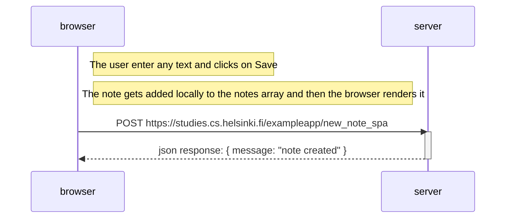

```mermaid
sequenceDiagram
    participant browser
    participant server

    Note right of browser: The user enter any text and clicks on Save
    Note right of browser: The note gets added locally to the notes array and then the browser renders it

    browser->>server: POST https://studies.cs.helsinki.fi/exampleapp/new_note_spa
    activate server
    server-->>browser: json response: { message: "note created" }
    deactivate server
```
